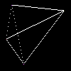

# Connect The Dots

This Python package draws lines between colored dots in a black image. You can either use the `"naive"` or the `"bresenham"` line-drawing algorithm. 
- The [naive](https://en.wikipedia.org/wiki/Line_drawing_algorithm) algorithm is simply based on the equation of a line. It is slow since it performs floating point multiplication in each iteration and it generates sparse results for very steep lines.
- The [Bresenham](https://en.wikipedia.org/wiki/Bresenham%27s_line_algorithm) algorithm is a classic line-drawing algorithm based solely on integer arithmetic, which is fast to compute. Starting from one coordinate and depending on an error variable, either x or y is incremented and the current pixel is inpainted until the other coordinate is reached.

Input Image             | Naive Algorithm |     Bresenham Algorithm
:-------------------------:|:-------------------------:|:-------------------------:
  |    |    


## Installation

Clone this repository and install it using `pip`. 

```bash
git clone https://github.com/axkoenig/connect_the_dots.git
pip install connect_the_dots
```

## Usage

To see the options you can pass to the `main.py` script run the follwing.
```bash
cd connect_the_dots
python main.py -h
usage: Connects colored dots on a black image with white lines. [-h] [--data_dir DATA_DIR] [--img_name IMG_NAME] [--logs_dir LOGS_DIR]
                                                                 [--log_name LOG_NAME] [--algorithm ALGORITHM] [--line_color LINE_COLOR [LINE_COLOR ...]]
                                                                 [--inpaint_start_and_end_pixels INPAINT_START_AND_END_PIXELS]

optional arguments:
  -h, --help            show this help message and exit
  --data_dir DATA_DIR   data directory for input and output images.
  --img_name IMG_NAME   name of image file in data directory.
  --logs_dir LOGS_DIR   log directory.
  --log_name LOG_NAME   name of the log file (date and time will be added).
  --algorithm ALGORITHM
                        name of the algorithm (either 'naive' or 'bresenham').
  --line_color LINE_COLOR [LINE_COLOR ...]
                        color of the connecting lines expressed in [r,g,b] format.
  --inpaint_start_and_end_pixels INPAINT_START_AND_END_PIXELS
                        Whether to inpaint start and end pixels with line color.
```

Processing an image is as easy as this! 
```bash
python main.py --data_dir "data" --img_name "four_dots.png" --algorithm "bresenham" --line_color 255 0 0
```
You should see the following output in your terminal. 
```bash
2021-12-27 22:08:46,939 - ConnectTheDots - [INFO]  Starting program.
2021-12-27 22:08:46,939 - ConnectTheDots - [DEBUG]  Instantiated ConnectTheDots class.
2021-12-27 22:08:46,948 - ConnectTheDots - [INFO]  Loaded image from path 'data/four_dots.png'.
2021-12-27 22:08:46,948 - ConnectTheDots - [INFO]  Connecting the dots ...
2021-12-27 22:08:47,015 - ConnectTheDots - [DEBUG]  Found non-black pixels at locations: [[7, 16], [15, 90], [55, 8], [90, 33]].
2021-12-27 22:08:47,016 - ConnectTheDots - [DEBUG]  Drawing line from [ 7 16] to [15 90] with bresenham algorithm.
2021-12-27 22:08:47,016 - ConnectTheDots - [DEBUG]  Drawing line from [55  8] to [ 7 16] with bresenham algorithm.
2021-12-27 22:08:47,017 - ConnectTheDots - [DEBUG]  Drawing line from [ 7 16] to [90 33] with bresenham algorithm.
2021-12-27 22:08:47,017 - ConnectTheDots - [DEBUG]  Drawing line from [55  8] to [15 90] with bresenham algorithm.
2021-12-27 22:08:47,018 - ConnectTheDots - [DEBUG]  Drawing line from [90 33] to [15 90] with bresenham algorithm.
2021-12-27 22:08:47,019 - ConnectTheDots - [DEBUG]  Drawing line from [55  8] to [90 33] with bresenham algorithm.
2021-12-27 22:08:47,020 - ConnectTheDots - [INFO]  Saved image to path 'data/four_dots_connected_bresenham.png'.
2021-12-27 22:08:47,020 - ConnectTheDots - [INFO]  Processing done!
2021-12-27 22:08:47,021 - ConnectTheDots - [INFO]  Done.
```

## Run Tests 

To run the tests navigate into the `test` directory and run the `tests.py` script.

```bash
cd connect_the_dots/tests
python tests.py
```
